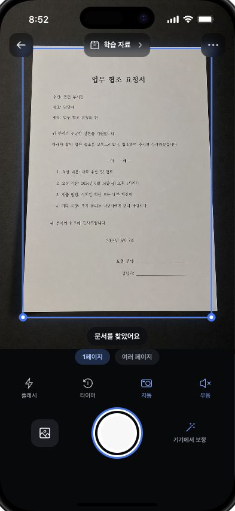
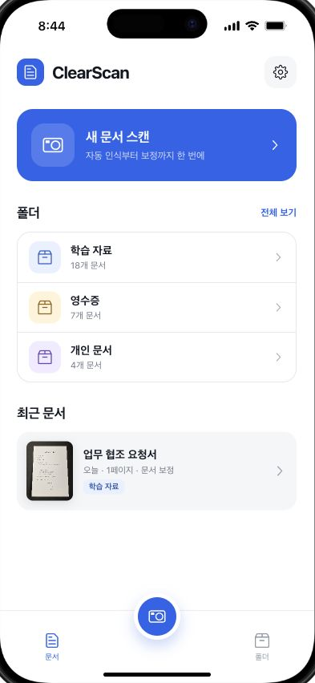
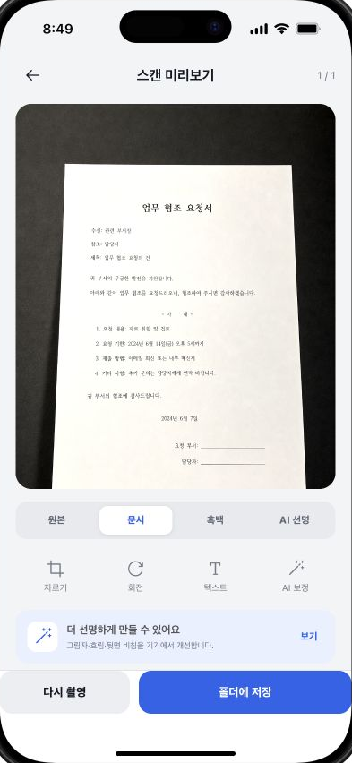

# ClearScan

오프라인 우선 iPhone/iPad 문서 스캐너와 선택형 로컬 companion 웹입니다.
UIKit, AVFoundation, Vision, SwiftData, FileManager를 중심으로 구성되어 있으며
계정·결제·분석 SDK 없이 개인 문서를 촬영하고 정리하는 것을 목표로 합니다.

[](https://github.com/fakeminjun7321/ClearScan/actions/workflows/ci.yml)
[](LICENSE)
[](ios/ClearScan)
[](ios/ClearScan/UIKitUI)

> **Alpha:** 코드, 단위 테스트, 시뮬레이터 검증과 실제 카메라·Google 실연동
> 검증을 구분합니다. 현재 공개 리비전의 실기기 자동촬영과 live Drive/Docs
> 결과는 아직 검증되지 않았습니다.

<p align="center">
  
  
  
</p>

## 주요 기능

- `한 페이지`와 `책 2페이지` 촬영
- AVFoundation 영상 프레임을 사용하는 완전 무음 경로와 선택형 고화질 촬영
- Vision 문서 분할 + 사각형 검출 + 대비 강화 fallback
- WeScan에서 영감을 받은 최근 프레임 합의와 원형 자동촬영 진행률
- 잘린 문서는 주황색 윤곽으로 안내하되 자동촬영을 막는 안전 게이트
- 프레임을 꽉 채우고 책등이 치우친 애매한 펼침면 복구
- 원근 보정, 중앙 책등 자동 추정·수동 조절, 좌우 페이지 순서 저장
- SwiftData 메타데이터 + FileManager 페이지 파일
- 폴더/문서/개별 페이지 선택과 실제 PDF/JPEG/ZIP 내보내기
- 로컬 OCR, 흐림·조명 보정, 품질 경고, 제한적 손가락/색 필기 제거
- UIKit 문서 편집, OCR 텍스트 수정, 선택 지우개, PencilKit 서명
- 선택형 Google Drive 업로드와 편집 가능한 Google Docs OCR 변환
- 로컬 API를 사용하는 선택형 React companion

## 애매한 책 스캔

사용자가 제공한 한 페이지 PDF에는 펼친 책이 화면을 거의 채우고 오른쪽 외곽이
잘렸으며, 책등이 약 66% 지점에 있었습니다. 기존 검출은 오른쪽 페이지만
선택했지만 책 모드 복구 후 전체 보이는 펼침면 98.5%와 책등 65.9%를
선택했습니다. 원본 PDF는 개인정보 보호를 위해 저장소에 포함하지 않고 동일한
실패 형태를 합성 테스트로 남겼습니다.

자세한 수치와 안전 조건은 [문서 검출 사례](docs/DETECTION_CASES.md)를
참조하세요.

## 빠른 시작

### Native iOS

요구사항: 전체 Xcode, iOS 17+ SDK, [XcodeGen](https://github.com/yonaskolb/XcodeGen).

```bash
git clone https://github.com/fakeminjun7321/ClearScan.git
cd ClearScan/ios/ClearScan
xcodegen generate
open ClearScan.xcodeproj
```

시뮬레이터 빌드에는 Apple 계정이 필요하지 않습니다. 개인 기기 설치는
[Personal Team 설치 안내](IOS_PERSONAL_INSTALL.md)를 따르세요.

### Companion web and local API

```bash
npm ci
npm run backend   # http://127.0.0.1:4174
npm run web       # http://localhost:4173
```

웹 Google 연결이 필요하면:

```bash
cp web/.env.example web/.env.local
```

Google Cloud 설정과 네이티브 `Local.xcconfig`는
[Google Drive/Docs 설정](GOOGLE_DRIVE_SETUP.md)에 정리되어 있습니다.
실제 OAuth Client ID, 토큰, Apple Team ID, 프로비저닝 파일은 저장소에
포함되지 않습니다.

## 저장소 구성

```text
ClearScan/
├── ios/ClearScan/       UIKit 앱, 캡처/AI/저장/내보내기, 테스트
├── web/                 Companion React 앱
├── server/              로컬 문서/페이지 API
├── src/                 휴대폰 프레임 프로토타입과 로컬 처리
├── worker/              선택형 companion 패키지
├── tests/               Backend/web/runtime 테스트
├── docs/                구조, 검증, 검출 사례, 협업 방식
├── design/              앱 아이콘 원본
└── audit/               비식별 UI 검토 스크린샷
```

- [전체 아키텍처](docs/ARCHITECTURE.md)
- [Git worktree와 멀티에이전트 협업](docs/WORKTREE_WORKFLOW.md)
- [검증 매트릭스](docs/VERIFICATION_MATRIX.md)
- [오픈소스 스캐너 비교](docs/OPEN_SOURCE_SCANNER_REVIEW.md)
- [로드맵](docs/ROADMAP.md)
- [변경 기록](CHANGELOG.md)

`work/`, `data/`, `minjun/`, `references/`, DerivedData, `.env.local`과 로컬
서명/OAuth 설정은 재현 불가능하거나 민감한 로컬 산출물이므로 Git에서
제외됩니다. 원래의 격리 사본과 실제 Git worktree 차이도 협업 문서에
기록했습니다.

## 검증

```bash
npm run check:runtime
npm run check:web
npm run test:backend
npm run test:sites
npm run build
npm run test:web
```

Native 단위 테스트:

```bash
cd ios/ClearScan
xcodegen generate
xcodebuild test \
  -project ClearScan.xcodeproj \
  -scheme ClearScan \
  -destination 'platform=iOS Simulator,name=<available simulator>' \
  -only-testing:ClearScanTests \
  CODE_SIGNING_ALLOWED=NO
```

정확한 통과 수와 미검증 경계는 [검증 매트릭스](docs/VERIFICATION_MATRIX.md)에
기록합니다.

## 기여와 보안

- [기여 가이드](CONTRIBUTING.md)
- [보안 정책](SECURITY.md)
- [제3자 라이선스와 연구 참고](THIRD_PARTY_NOTICES.md)

스캔 문서, OAuth 토큰, 서비스 계정 키, 프로비저닝 프로필 또는 개인 경로를
이슈나 PR에 첨부하지 마세요.

## 라이선스

[MIT](LICENSE). 외부 의존성과 참고 프로젝트는 각자의 라이선스를 유지합니다.
