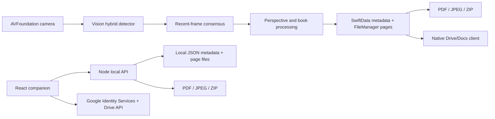

# ClearScan architecture

ClearScan contains three cooperating but independently runnable surfaces.

## Native UIKit app

- `ios/ClearScan/App`: UIKit application and scene entry points.
- `ios/ClearScan/UIKitUI`: library, camera, editor, settings, and Google screens.
- `ios/ClearScan/Capture`: camera session, orientation mapping, Vision detection,
  temporal consensus, perspective correction, and book splitting.
- `ios/ClearScan/Core`: persistence, storage, export, OCR, analysis, and local
  image enhancement.
- `ios/ClearScan/CoreTests` and `UITests`: native regression and UI coverage.

The shipping target is UIKit. Older SwiftUI prototype files remain excluded from
the target as design/reference material.

## Companion and backend

- `web/`: document selection, export, and browser Google Drive/Docs flow.
- `server/`: local folder/document/page persistence and export API.
- `src/`: phone-frame prototype and deterministic browser enhancement.
- `worker/`: packaged companion worker used by the optional hosted artifact.

Native storage and web storage intentionally do not share a hidden cloud
database. Both use the same conceptual shape: `Folder -> Document -> Pages[]`.

## Privacy boundary

Camera analysis and native enhancement run on-device. Network transfer happens
only after an explicit Google upload. The public repository contains neither
sample user scans nor live OAuth/signing configuration.
